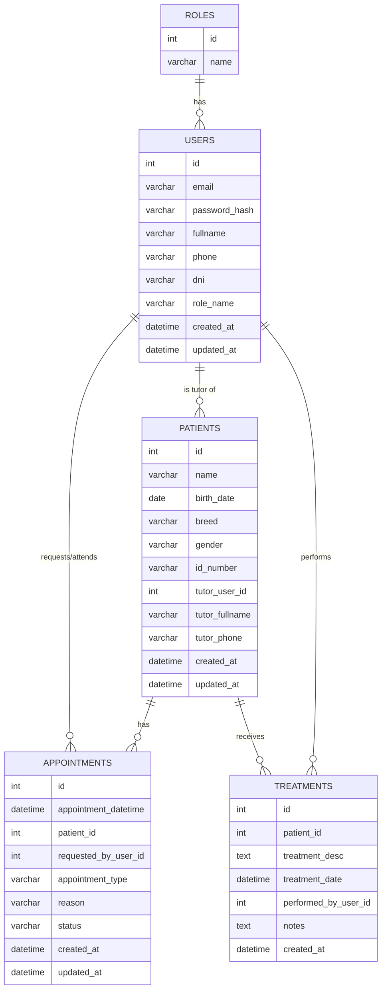

# 🐾 HappyPaws - Backend

Este proyecto corresponde al **sistema de gestión de pacientes** para la clínica veterinaria de Margarita.  
El backend está desarrollado en **Java con Spring Boot**, y expone una API REST que permite gestionar usuarios, pacientes, citas y tratamientos.

---

## 🚀 Tecnologías utilizadas

- Java 21
- Spring Boot
- Spring Data JPA (Hibernate)
- Spring Security (autenticación y autorización con JWT)
- MySQL
- Maven

---

## ⚙️ Funcionalidades implementadas

- Registro de usuarios.
- Login con validación de credenciales.
- Roles: **Administrador** y **Cliente**.
- Seguridad con JWT (JSON Web Token).
- Relación entre usuarios, pacientes, citas y tratamientos.

---

## 🗄️ Modelo de datos

La base de datos se ha diseñado siguiendo un modelo relacional.  
Diagrama en formato Mermaid:



---

## 📦 Instalación y ejecución

1. Clonar el repositorio:
   ```bash
   git clone https://github.com/tu-repo/backend.git
   ```
2. Entrar al directorio:
   ```bash
   cd backend
   ```
3. Configurar la base de datos en `application.properties`:
   ```properties
   spring.datasource.url=jdbc:mysql://localhost:3306/happypaws
   spring.datasource.username=tu_usuario
   spring.datasource.password=tu_password
   spring.jpa.hibernate.ddl-auto=update
   ```
4. Compilar y ejecutar:
   ```bash
   mvn spring-boot:run
   ```

---

## 🔑 Endpoints principales

- `POST /api/auv1th/register` → Registro de usuario  
- `POST /api/v1/login` → Login de usuario

---
